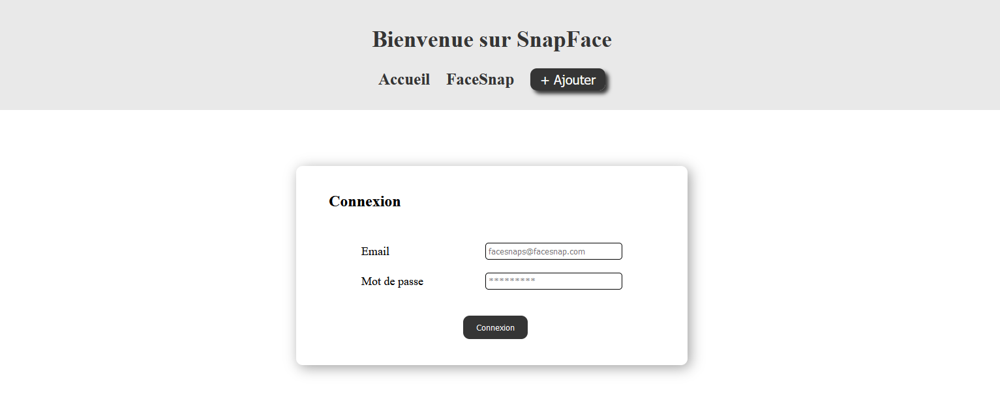
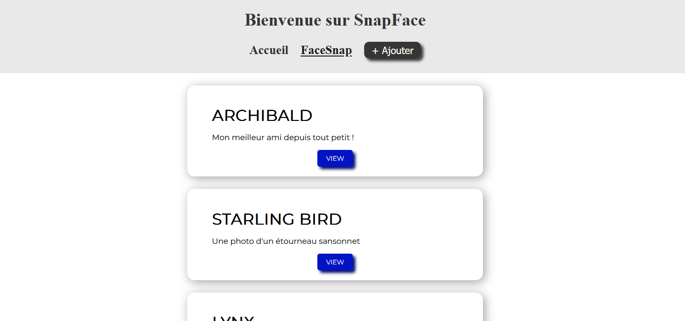
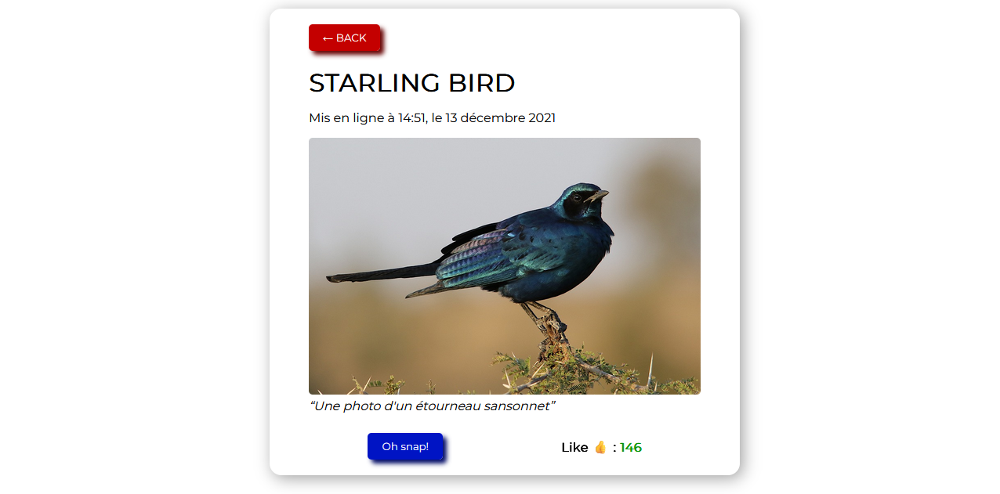
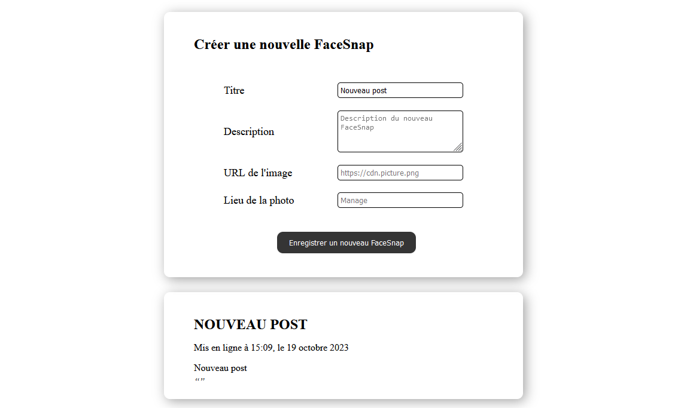

# Apprentissage d'Angular avec l'application SnapFace

<p align="center">
    
    
    
</p>

## But de l'application

Cette application a pour but d'afficher divers snapface présent dans la base de données. Pour pouvoir avoir accès aux différents snapface, il est nécessaire de se connecter. Chacun des snapface peuvent être liké. Enfin, un formulaire d'ajout est disponible dans l'application afin d'ajouter un snapface avec un affichage en temps réel.

## Lancer le projet en local

Pour la partie frontend: 

```
ng serve
```

Pour la partie backend: 
```
cd backend
npm run start
```

## Eléments appliqués dans cette application

- [x] Les components Angular
- [x] Les directives
- [x] Les pipes
- [x] Les services
- [x] Le routing
- [x] Les observables
- [x] Les formulaires
- [x] Les requêtes HTTP
- [x] Les modules
- [x] Les guards
## Rendu de l'application






This project was generated with [Angular CLI](https://github.com/angular/angular-cli) version 14.0.2.

